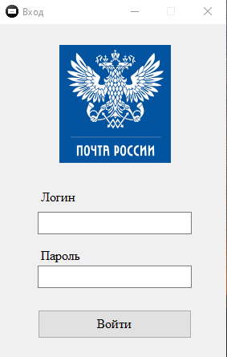
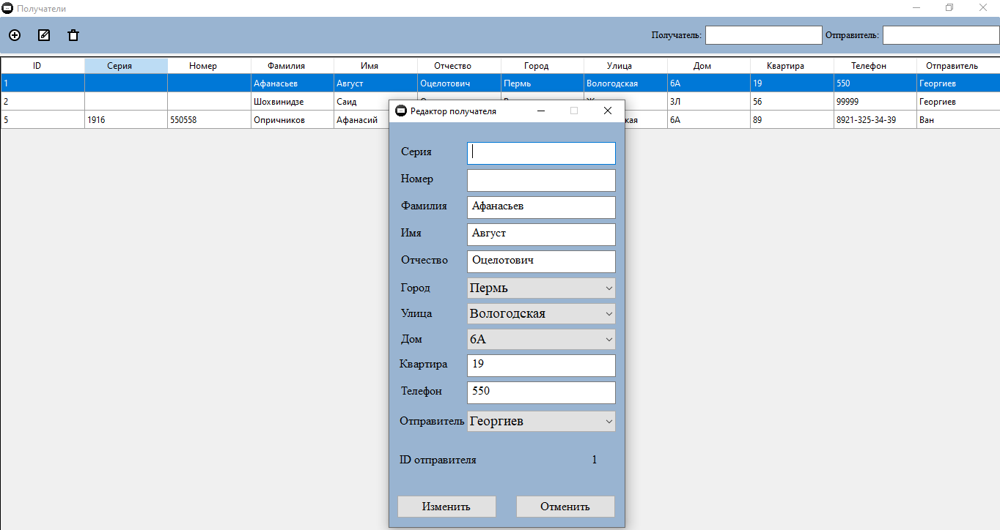
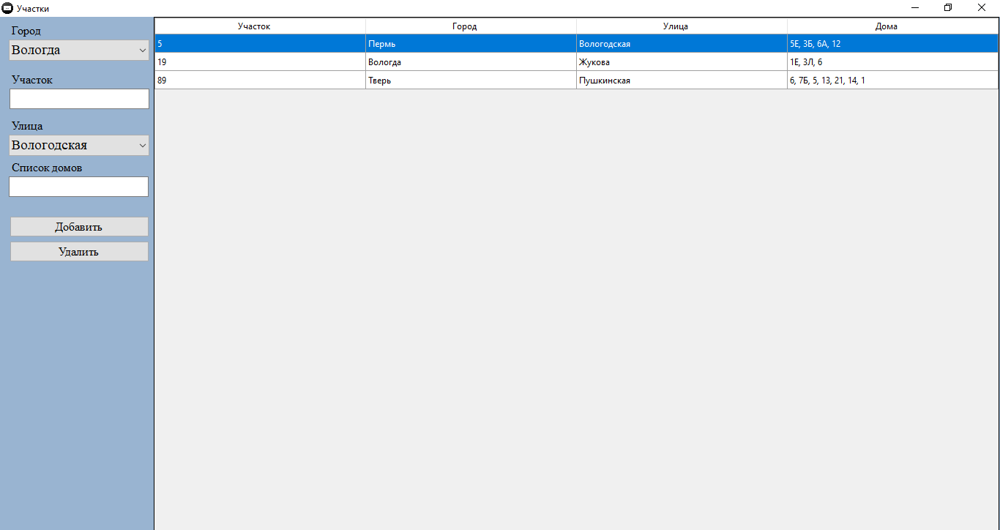
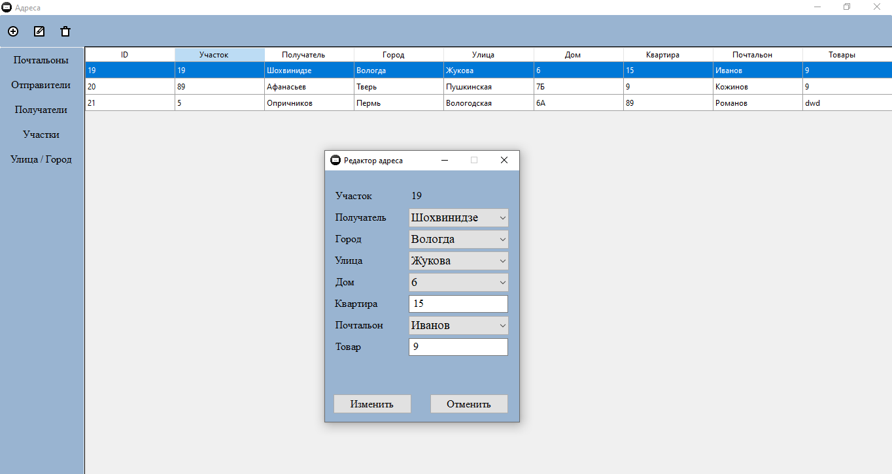

# Репозиторий проекта PostSys

## Технологии Приложения:
* MS .NET 7 Core
* WinForms
* Entity Framework Tools

## База данных:
* MS SQL
* Файл с базой данной расположен в "src/shared/DataBase"
* Необходимо подключить на сервер, сменив путь подключения в:
  "src/postSys.application.prj/App.Config", переменная connectionString

## Пароль для входа:
* Логин: nano
* Пароль: 1

### Сриншоты Приложения:

