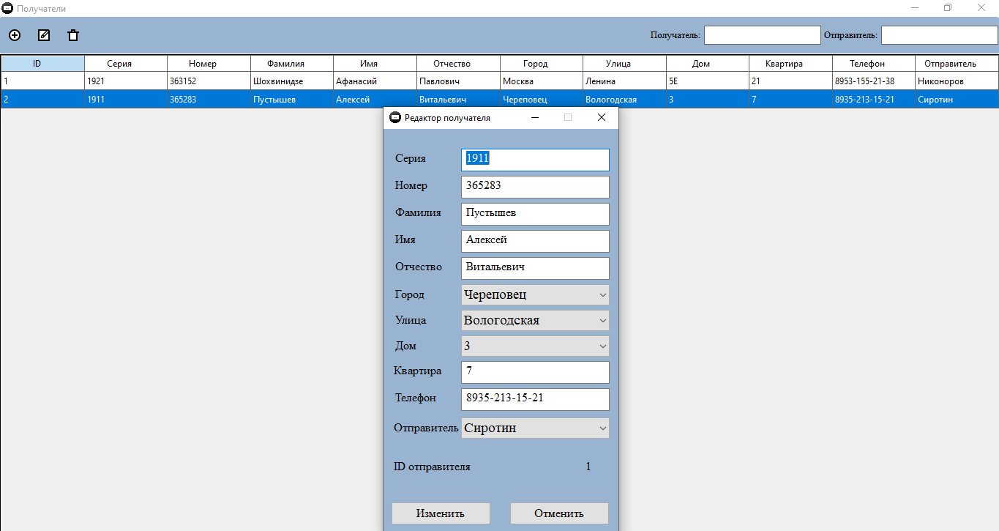
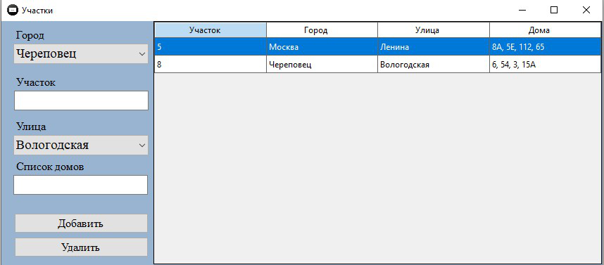
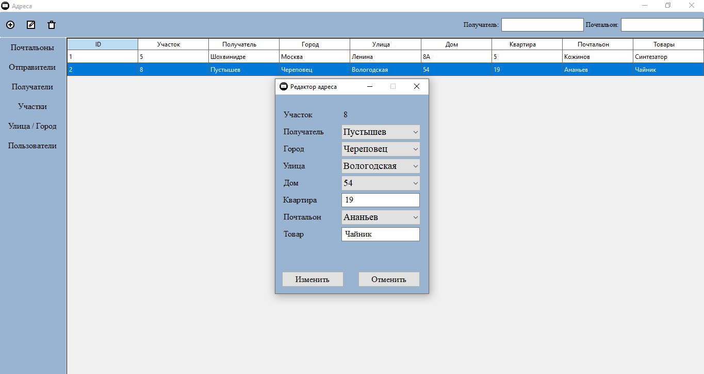

# Репозиторий проекта PostSys

## Технологии Приложения:
* .NET 8 Core
* WinForms
* Autofac
* Entity Framework
* Serilog

## База данных:
* MySQL
* Скрипт создания базы данных расположен в "src/shared/DataBase"
* Строка подключения задаётся в "src/postSys.application.prj/App.Config"

## Как запустить приложение:
Если нет MS Visual Studio 2022:
1. Убедиться, что установлен пакет SDK для .NET 8.0.
2. Клонировать репозиторий PostSys.
3. Запустить "build.cmd".
4. Запустить exe-файл "postSys.application", расположенный по пути "src/postSys.application.prj/bin/Release/net8.0/".

Если установлен MSVS2022, также можно открыть файл решения PostSys.sln и собрать его.

## Логи:
Логи приложения хранятся в "C:/ProgramData/postSys.application/Logs"

## Пароль для входа:
* Логин: nano
* Пароль: 1

### Сриншоты Приложения:

